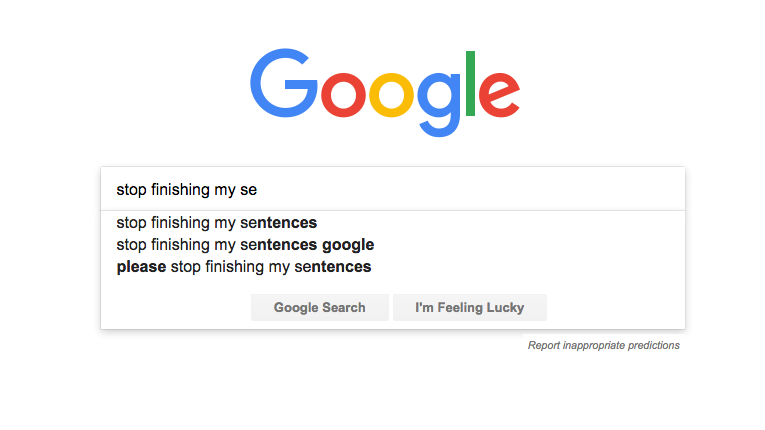

```{r setup, include=FALSE}
knitr::opts_chunk$set(echo = TRUE, 
                      fig.align = "center")
```

<style>
body {
text-align: justify}
</style>

# Introduction {.tabset}

## Text Generation 

Natural Language Processing (NLP) is a branch of artificial intelligence that is steadily growing both in terms of research and market values[^1]. The ultimate objective of NLP is to read, decipher, understand, and make sense of the human languages in a manner that is valuable[^2]. The are many applications of NLP in various industries, such as:

* SPAM email detection
* Sentiment Analysis
* Text summarization
* Topic Modelling
* Text Generation

In this article, we will try to learn the last one: text generation. The goal of text generation is to create a predictive text or an auto-generated text based on the previous typed term or word. The easiest example of text generation is the predictive text when you type in the search tab of Google[^3] or when you write an email. 

> Autocomplete is especially useful for those using mobile devices, making it easy to complete a search on a small screen where typing can be hard. For both mobile and desktop users, it’s a huge time saver all around.
> `r tufte::quote_footer(' Danny Sulivan, Google Public Liaison for Search')`

```{r out.width="80%", echo=FALSE}

```

Another implementation of text generation is to create an artificial text or script, which can be potentially applied to generate artificial news, create a better movie synopsis, create poems, or even create an entire book. 

The following text is generated using the natural language processing model architecture called GPT-2[^4]. You can try to create one by visiting <a href = https://talktotransformer.com/> the website </a> made by Adam King[^5].

```{r out.width="60%", echo=FALSE}
knitr::include_graphics("asset/gpt.png")
```

GPT-2 is a very sophisticated model that use more than 8 million web pages as it training dataset. However, due to the great potential to be misused, the developers decided not to release the trained model. An alternative to create our own custom text generator is using the Recurrent Neural Network and it's LSTM companion[^6]. However, there is a simpler approach to create a text generator using a model called Markov Chain[^7]. Markov Chain is a mathematical model of stochastic process that predicts the condition of the next state (e.g. will it rain tomorrow?) based on the condition of the previous one. Using this principle, the Markov Chain can predict the next word based on the last word typed. Victor Powell[^8] has dedicated a great website to visualize how Markov Chains work.

Through this article, we will explore the mechanism behind Markov Chains and how to apply it to create a text generator.

## Training Objective

The goal of this article is to help you:

* Understand the concept of Markov Chain
* Understand the concept of transition probability matrix
* Implement Markov Chain to create a text generator

## Library and Setup

The following package is required for the next section. 

```{r message=FALSE, warning=FALSE}
# Data wrangling
library(tidyverse)

# Text processing
library(tidytext)
library(textclean)

# Markov Chain
library(markovchain)
```

# Markov Chain

## General Concept


## Transition Probability Matrix


## Steady-state


# Use Case

To show the wide-range application of Markov Chains, I have provided use cases in two fields: marketing and NLP. In marketing field, we will see how Markov Chain can be deployed to predict the expected lifetime value of customers while in NLP we will see how Markov Chain can be used to create a text generator.

## Customer Lifetime Value Analysis


## Text Generation

This part will illustrate how Markov Chain can be applied to make a text generator.

Before we create a big and complex text generator using a corpus or collection of text data, first let's create a simple one. I will use a single sentence and build a text generator based on words present on the sentence.

```{r out.width="40%", echo=FALSE}

```

First, we prepare the sentence, a generic one: the quick brown fox jumps over the lazy dog and the angry dog chase the fox. The single text will be splitted/tokenized without removing the word sequences.

```{r}
# a single sentence
short_text <- c("the quick brown fox jumps over the lazy dog and the angry dog chase the fox")

# split the sentence into words
text_term <- strsplit(short_text, split = " ")

text_term
```

Now that we have the terms and it's sequence, we can build a Markov Chain and visualize the networks.

```{r}
fit_markov <- markovchainFit(text_term)

set.seed(123)
plot(fit_markov$estimate)
```

The subsequent words are generated based on the transition probability (the number on the graph). For example, if the current word is `dog`, the next word can be `chase` and word `and`, with equal probability of 0.5 to appear. If the current word is `chase`, the next word must be `the` because it has probability of 1 to appear afer word `chase`.

Now we can try to generate a text using the markov chain. Here, I only type word `the` and let the model finish the sentence. We will generate 5 different phrases.

```{r}

for (i in 1:5) {

   set.seed(i)
   markovchainSequence(n = 7, # generate 7 next words 
                       markovchain = fit_markov$estimate,
                       t0 = "the", include.t0 = T) %>%  # set the first word
   
   # joint words
   paste(collapse = " ") %>% 
   paste0(".") %>% 
   print()
}
```

Does the sentences make sense? Yes, but only some of them. The number of words generated also affect whether the sentence will make sense or not, such as the third sentence that end with `and`, making it an incomplete sentence, while the second and fourth sentence can be a complete sentence. We may want to cut the sentence at certain point to make it a better sentence.

Next, we can try to create more complex model using `Movie Plot` dataset from Kaggle.

### Import Dataset

The data come from <a href = "https://www.kaggle.com/jrobischon/wikipedia-movie-plots"> Wikipedia Movie Plots </a>, which contains various movies from 1901 up to 2017.

```{r}
movie <- data.table::fread("data_input/wiki_movie_plots_deduped.csv", showProgress = F)

head(movie, 10)
```


Imagine if we are a production studio and we want to make the next best-seller movie. We may want to gather a lot of great writers to gain a lot of inspiration and ideas for the plot. We also want to rely on the cutting-edge technology of text generator in order to help us during the brainstorming session. Movie plots produced by the machine will be evaluated by the panel and producer to see if it will sell at the market. Our producer is looking forward to make a new movie with *Mystery* genre, so our task as the data scientist is to figure out how to create a text generator that will produce a high-quality mystery movie plot.

Our first task is to filter out the data and only concern about a movie with *mystery* genre.

```{r}
mystery_movie <- movie %>% 
   filter( str_detect(Genre, pattern = "mystery") )

nrow(mystery_movie)
```

There are 481 *mystery* movie from 1901 up to 2017. You may suggest to do further selection, such as looking only at a recent movies (last 2 decades) or you may even suggest that we only consider a Box Office movie, movie that has big revenues. However, we will proceed with the current dataset for now.

### Text Cleansing

Before we create the Markov Chain, we need to clean the text with basic text preprocessing, such as lowercase all text, replace word contraction, etc. 

```{r}
mystery_movie <- mystery_movie %>% 
   mutate(Plot = Plot %>% 
             tolower() %>% 
             replace_contraction() %>% 
             replace_word_elongation() %>%
             str_remove_all( pattern = "[:punct:]") %>% 
             replace_curly_quote() %>% 
             replace_white()
             )

# Split sentence into words
movie_term <- strsplit(mystery_movie$Plot, " ")
```

### Model Fitting

Now we will fit the data into Markov Chains.

```{r eval=FALSE}
tictoc::tic()
fit_markov <- markovchainFit(movie_term, parallel = T)
tictoc::toc()
```

```{r}

for (i in 1:10) {

   markovchainSequence(n = 20, # generate 7 next words 
                       markovchain = fit_markov$estimate) %>%  
   
   # joint words
   paste(collapse = " ") %>% 
   paste0(".") %>% 
   print()
}
```


# Conclusion


# Reference

[^1]: [Natural Language Processing Is a Key Engine of AI Market Growth, Enabling 44 Discrete Use Cases Across 17 Industries](https://tractica.omdia.com/newsroom/press-releases/natural-language-processing-is-a-key-engine-of-ai-market-growth-enabling-44-discrete-use-cases-across-17-industries/)
[^2]: [A Simple Introduction to Natural Language Processing](https://becominghuman.ai/a-simple-introduction-to-natural-language-processing-ea66a1747b32)
[^3]: [How Google Autocomplete Works](https://www.blog.google/products/search/how-google-autocomplete-works-search/)
[^4]: [OpenAI GPT-2](https://openai.com/blog/better-language-models/#sample2)
[^5]: [Talk to Transformer](https://talktotransformer.com/)
[^6]: [Text Generation With LSTM Recurrent Neural Networks in Python with Keras](https://machinelearningmastery.com/text-generation-lstm-recurrent-neural-networks-python-keras/)
[^7]: [Markov Chains: How to Train Text Generation to Write Like George R. R. Martin](https://www.kdnuggets.com/2019/11/markov-chains-train-text-generation.html)
[^8]: [Markov Chains Explained Visually](https://setosa.io/ev/markov-chains/)
