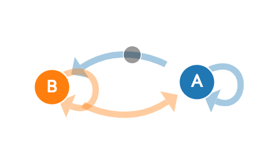

```{r setup, include=FALSE}
knitr::opts_chunk$set(echo = TRUE, 
                      fig.align = "center")
```

<style>
body {
text-align: justify}
</style>

# Introduction {.tabset}

## Text Generation 

Natural Language Processing (NLP) is a branch of artificial intelligence that is steadily growing both in terms of research and market values[^1]. The ultimate objective of NLP is to read, decipher, understand, and make sense of the human languages in a manner that is valuable[^2]. The are many applications of NLP in various industries, such as:

* SPAM email detection
* Sentiment Analysis
* Text summarization
* Topic Modelling
* Text Generation

In this article, we will try to learn the last one: text generation. The goal of text generation is to create a predictive text or an auto-generated text based on the previous typed term or word. The easiest example of text generation is the predictive text when you type in the search tab of Google[^3] or when you write an email. 

> Autocomplete is especially useful for those using mobile devices, making it easy to complete a search on a small screen where typing can be hard. For both mobile and desktop users, it’s a huge time saver all around.
> `r tufte::quote_footer(' Danny Sulivan, Google Public Liaison for Search')`

```{r out.width="80%", echo=FALSE}
knitr::include_graphics("asset/google.png")
```

Another implementation of text generation is to create an artificial text or script, which can be potentially applied to generate artificial news, create a better movie synopsis, create poems, or even create an entire book. 

The following text is generated using the natural language processing model architecture called GPT-2[^4]. You can try to create one by visiting <a href = https://talktotransformer.com/> the website </a> made by Adam King[^5].

```{r out.width="60%", echo=FALSE}
knitr::include_graphics("asset/gpt.png")
```

GPT-2 is a very sophisticated model that use more than 8 million web pages as it training dataset. However, due to the great potential to be misused, the developers decided not to release the trained model. An alternative to create our own custom text generator is using the Recurrent Neural Network and it's LSTM companion[^6]. However, there is a simpler approach to create a text generator using a model called Markov Chain[^7]. The state-of-the-art or the development of text generation can be found at Fonseca[^8].

Markov Chain is a mathematical model of stochastic process that predicts the condition of the next state (e.g. will it rain tomorrow?) based on the condition of the previous one. Using this principle, the Markov Chain can predict the next word based on the last word typed. Victor Powell[^9] has dedicated a great website to visualize how Markov Chains work.

Through this article, we will explore the mechanism behind Markov Chains and how to apply it to create a text generator and some other use cases.

## Training Objective

The goal of this article is to help you:

* Understand the concept of Markov Chain
* Understand the concept of transition probability matrix
* Implement Markov Chain in several business cases
* Implement Markov Chain to create a text generator

## Library and Setup

The following package is required for the next section. 

```{r message=FALSE, warning=FALSE}
# Data wrangling
library(tidyverse)

# Text processing
library(tidytext)
library(textclean)

# Markov Chain
library(markovchain)
```

# Markov Chain

## General Concept

Markov Chain is a mathematical model of stochastic process that predicts the condition of the next state based on condition of the previous state. 

```{r echo=FALSE, out.width="40%"}

```

From the above network, let's say we consider two states: A (rain) and B (sunny). If today weather is in state A (rain), tomorrow can be rain again, indicated by the circular loop, or it can be sunny (B). The same goes for the state B, it can go from state B to B again on the next day, or it can be rainy (A). Each transition from A to A or A to B will have it's own probability to happen. The Markov Chain will model the probability of transition between the current state toward the next one.

For more illustrative example, let's say we have a data of weather condition for the past 100 days.

```{r}
weather <- c("sunny", "sunny", "rain", "cloudy")

set.seed(123)
weather_data <- sample(weather, 100, replace = T)
head(weather_data, 10)
```

If today weather is sunny, what is the probability that tomorrow will be sunny again? We simply just need to calculate how many times if today is sunny and the next day is sunny as well from the past data.

```{r}
embed(weather_data, 2)[, 2:1] %>% 
   as.data.frame() %>% 
   rename(current = V1, next_day = V2) %>% 
   filter(current == "sunny") %>% 
   arrange(next_day) %>% 
   count(current, next_day)
```

Based on the data, if current day is sunny,  there are 6 occurences that the next day would be cloudy, 18 occurences that the next day is rain, and 30 occurences that the next day is sunny again. Based on the data, we can directly calculate the probability. For example, if the current day is sunny, the probability that the next day would be sunny again is:

$$P(tomorrow = sunny|today = sunny) = \frac{30}{30+6+18} = 0.556$$

This probability is called as the **Transition Probability** and represent the probability that tomorrow will be sunny if today is sunny. Below is the probability for each next state if today is sunny.

```{r echo=FALSE}
embed(weather_data, 2)[, 2:1] %>% 
   as.data.frame() %>% 
   rename(current = V1, next_day = V2) %>% 
   filter(current == "sunny") %>% 
   pull(next_day) %>% 
   table("Probability of each weather tomorrow if today is sunny" = .) %>% prop.table()
```

The above probability only consider that the current state (today) is sunny. We also need to consider other condition of the current state, which includes cloudy and rain. 

```{r}
embed(weather_data, 2)[, 2:1] %>% 
   as.data.frame() %>% 
   rename(current = V1, next_day = V2) %>% 
   filter(current == "cloudy") %>% 
   pull(next_day) %>% 
   table("Probability of each weather tomorrow if today is cloudy" = .) %>% prop.table()
```


To simplify the calculation, we can use `markovchainFit()` function from the `markovchain` package. The Markov Chains can also be presented visually.

```{r}
markov_weather <- markovchainFit(weather_data)
set.seed(2)
plot(markov_weather$estimate)
```

The arrow indicate the transition toward the next state while the number shows the probability of those transition. For example, there is a probability of 0.32 for transition from rain today toward cloudy tommorow. If the next state is the same as the current state, the arrow will make a loop toward itself, like the 25% probability of rain today to rain again tommorow.

## Transition Probability Matrix

The Markov Chains is often more often represented as a transition probability matrix instead of a graph, with each row indicate the current states while each column indicate the next states. Based on the previous graph, we can convert it into the following transition matrix:

```{r}
markov_weather$estimate
```

Some characteristic of the transition probability matrix:

* The transition matrix is always a square matrix or n-by-n matrix (number of rows and columns are the same)
* The dimension of transition matrix is determined by the number of possible states
* The row represent the current state
* The column represent the next state
* The total probability for each current state (row) is 1
* The next/future state is only depends on the current state, this properties is called **Lack of Memories**

So, based on the transition matrix, if today is cloudy, the chance that tomorrow will be sunny is 70.5%. But what about the next 2 days? Or even the next 7 days?

By using Markov Chains, we can get the transition matrix for the next *n*-period by simply multiply the transition matrix with itself. For example, if we want to get the transition matrix for the next 2 days:

```{r}
markov_weather$estimate * markov_weather$estimate
```

So, if today is cloudy, the chance that the next 2 days is sunny is 55.08%. How can we achieve at such conclusion? This principle is called the **Chapman-Kolmogorov Equation**. 

$$p_{ij}^{n} = \Sigma_{k=1}^{M} p_{ik}^{m}\ p_{kj}^{n-m}$$

$p_{ij}^{n}$ = probability that the system will be at state *j* at the *n-step* if it is on the state *i* during *m-step*. Basically, it means that in order to arrive at the sunny state at the second day, there are multiple route that can be traveled:

* today cloudy -> tomorrow sunny -> next 2 days sunny
* today cloudy -> tomorrow cloudy -> next 2 days sunny
* today cloudy -> tomorrow rain -> next 2 days sunny

We just need to calculate the probability for each routes and sum it all at the end.

Let's go back to the initial transition matrix:
```{r}
markov_weather$estimate
```

Based on the **Chapman-Kolmogorov**, the probability to be sunny at the next 2 days if today it is cloudy is:

$$p_{cloudy\ sunny}^{2} = \Sigma_{k=0}^{3} p_{cloudy\ k}^{1}\ p_{k\ j}^{2-1}$$

$$p_{cloudy\ sunny}^{2} = p_{cloudy\ cloudy}^{1}\ p_{cloudy\ sunny}^{2-1} + p_{cloudy\ sunny}^{1}\ p_{sunny\ sunny}^{2-1}+p_{cloudy\ rain}^{1}\ p_{rain\ sunny}^{2-1}$$

$$p_{cloudy\ sunny}^{2} = 0.1176\ \ 0.7059 + 0.1765\ 0.4286+ 0.7059\ 0.5556 = 0.5509$$

If we go back to the matrix multiplication:

```{r}
markov_weather$estimate * markov_weather$estimate
```

The probability from cloudy to sunny in the next 2 days is 0.5508.

For the next 7 days, we simply multiply the matrix 7 times:

```{r}
markov_weather$estimate^7
```

So for the next 7 days, the chance of sunny if today is cloudy is 54.5%.

Transition Matrix for the next 14 days:
```{r}
markov_weather$estimate^14
```

## Steady-state

In Markov Chains, there exist a condition where regardless of the current state, the probability for the next state is always the same. We can see it at the transition matrix for the next 14 days at the previous section. For example, regardless if today is cloudy, rain, or sunny, the probability that tomorrow will be sunny is always 0.545. This condition is called the **Steady-state** of the transition matrix.

To get the steady-state of the Markov Chains, we simply use `steadyStates()` function.

```{r}
steadyStates(markov_weather$estimate)
```

Based on the result, regardless of the current weather, the probability that tomorrow will be cloudy is 0.17, tomorrow will be rain is 0.28 and tomorrow will be sunny is 0.545.

## Absorbing State

Supossed that we have the following transition matrix from Health Insurance:

```{r}
# create transition matrix
transition_matrix <- matrix(c(0.5, .25, .15, .1,
                              0.4, 0.4, 0.0, 0.2,
                              0, 0, 1, 0,
                              0, 0, 0, 1), 
                            byrow = TRUE, nrow = 4)

# convert the matrix as a markov chain object
markov_model <- new("markovchain", transitionMatrix = transition_matrix, 
                    name = "Health Insurance", 
                    states = c("active", "disable", "withdrawn", "death"))

markov_model
```

If the current state is withdrawn, the next is certainly withdrawn as well since it has the transition probability of 1. The same thing happens when the current state is death. This state is called **Absorbing States**, because once the system entered this state, it cannot left. The system will loop and staty at the state. Once people withdrawn their insurance, they next state will stay withdrawn and cannot be active again. Once the insured is death, they cannot be active or alive again (hopefully).

To acquire the absorbing state of the Markov Chains, we simply use `absorbingState()` function.

```{r}
absorbingStates(markov_model)
```

Based on the result, the absorbing state for Health Insurance is `withdrawn` and `death`.

# Use Case

There are many application of Markov Chains in various field of industries. Before we proceed to the main topic of text generation, I will illustrate some use cases of Markov Chains in a health insurance. You may skip this section if you only wish to learn how to create a text generator.

## Machine Maintenance

This problem is derived from Hillier and Lieberman[^9]. A manufacturer has one key machine at the core of one of its production processes. Because of heavy use, the machine deteriorates rapidly in both quality and output. Therefore, at the end of each week, a thorough inspection is done that results in classifying the condition of the machine into one of four possible states:

* 1: Good - No apparent problem
* 2: Operable with minor deterioration
* 3: Operable with major deterioration
* 4: Inoperable due to bad quality

The transition matrix for this problem is as follows.

```{r}
transition_matrix <- matrix(c(0, 7/8, 1/16, 1/16,
                              0, 3/4, 1/8, 1/8,
                              0, 0, 1/2, 1/2,
                              1, 0, 0, 0), 
                            byrow = TRUE, nrow = 4)

transition_matrix
```

Based on the transition matrix, we can see that an inoperable machine will go back to the state of Good as new. This is because the company cannot let the machine to stay broken since the production target must be met. The machine would be repaired or replaced. The replacement process takes 1 week to complete so that production is lost for this period. The cost of the lost production (lost profit) is USD 2,000, and the cost of replacing the machine is USD 4,000; so the total cost incurred whenever the current machine enters state 4 is USD 6,000. Even before the machine reaches state 3, costs may be incurred from the production of defective items. When the machine is in minor deteroriation (state 2), the expected costs per week is USD 1,000 while if the machine is in a major deteroriation (state 3), the expected cost per week is USD 3,000. Another cost that can be incurred is when we do an overhaul toward the machine, which incurr USD 2000 for maintenance while also making us lost USD 2000 of profit.

Below is the complete list of the cost and when the cost can be incurred:

```{r}
cost_df <- data.frame(policy = c("do nothing", "do nothing", "do nothing", "overhaul", "replace"),
           state = c(1, 2, 3, 4, "2, 3, 4"),
           cost_due_to_defect = c(0, 1000, 3000, 0, 0),
           maintenance_cost = c(0, 0, 0, 2000, 4000),
           profit_lost = c(0, 0, 0, 2000, 2000),
           total_cost = c(0, 1000, 3000, 4000, 6000)
           )

cost_df
```

What is the optimal maintenance policy? Should we do nothing at all? Or do we need to overhaul everytime the machine go to major deteroriation (state 3)? Do we need to replace the machine every time it deviate from state 1? We will discuss it one at a time.

First, from the transition matrix, we will create a `markovchain` object.

```{r}
markov_model <- new("markovchain", transitionMatrix = transition_matrix, 
                    name = "Machine Opeation", states = c("Good", "Minor", "Major", "Inoperable"))

set.seed(123)
plot(markov_model)
```

### First Policy

First we will employ the policy to replace the machine eveytime it reach the inoperable condition (state 1).

To evaluate this maintenance policy, we should consider both the immediate costs incurred over the coming week (just described) and the subsequent costs that result from having the system evolve in this way. A widely used measure of performance for Markov chains is the (long-run) **expected average cost per unit time**. To calculate this measure, we first derive the steady-state probabilities. If you remember, steady-state means that regardless of the previous state, the probability for the next is all the same.

```{r}
steadyStates(markov_model)
```

Hence, the (long-run) expected average cost per week for this maintenance policy is:

$$0\ \pi_1 + 1000\ \pi_2\ +\ 3000\ \pi_3\ +\ 6000\ \pi_4$$

```{r}
cost <- c(0, 1000, 3000, 6000)

policy_1 <- (steadyStates(markov_model) * cost) %>% sum()
policy_1
```

If we replace the machine eveytime it reach the inoperable condition (state 4), the expected cost is USD 1923.08.

### Second Policy

The second policy is to replace the machine when it is inoperable (state 4) and overhaul it when it get to major deteroriation (state 3). Since overhauling can make our machine condition to be better, the transition matrix is changed from the previous one. Everytime the machine get overhauled, it would go from major deteroriation to minor deteroriation.

```{r}
transition_matrix <- matrix(c(0, 7/8, 1/16, 1/16,
                              0, 3/4, 1/8, 1/8,
                              0, 1, 0, 0,
                              1, 0, 0, 0), 
                            byrow = TRUE, nrow = 4)

markov_model <- new("markovchain", transitionMatrix = transition_matrix, 
                    name = "Machine Opeation", states = c("Good", "Minor", "Major", "Inoperable"))

set.seed(123)
plot(markov_model)
```

By employing overhaul with cost of USD 4000,the cost for state 3 goes from mere USD 3000 (cost due to defect) to USD 4000.

The expected average cost is as follows.

```{r}
cost <- c(0, 1000, 4000, 6000)

policy_2 <- (steadyStates(markov_model) * cost) %>% sum()
policy_2
```

### Third Policy

The third policy is to replace the machine every time it goes to state 3 and state 4. The transition matrix is once again change, because by replacing the machine, it will go from state 3 directly toward state 1 (Good) instead of going to state 2 (minor deteroriation).

```{r}
transition_matrix <- matrix(c(0, 7/8, 1/16, 1/16,
                              0, 3/4, 1/8, 1/8,
                              1, 0, 0, 0,
                              1, 0, 0, 0), 
                            byrow = TRUE, nrow = 4)

markov_model <- new("markovchain", transitionMatrix = transition_matrix, 
                    name = "Machine Opeation", states = c("Good", "Minor", "Major", "Inoperable"))

set.seed(123)
plot(markov_model)
```

The expected average cost is as follows.

```{r}
cost <- c(0, 1000, 6000, 6000)

policy_3 <- (steadyStates(markov_model) * cost) %>% sum()
policy_3
```

We recap the cost associated with each policy.

```{r}
data.frame(policy = c("Only replace machine when inoperable", "Replace and overhaul", "Replace when major deteroriation and inoperable"),
           `expected cost` = c(policy_1, policy_2, policy_3))
```

Based on the expected average cost, we can see that by combining machine replacement and overhaul, we can expect the minimum cost. Thus, we should employ this policy. There are a lot of other application of Markov Chains in manufacturing, such as in inventory management, quality control, even in customer management.

## Health Insurance

Actuaries quantify the risk inherent in insurance contracts, evaluating the premium of insurance contract to be sold (therefore covering future risk) and evaluating the actuarial reserves of existing portfolios (the liabilities in terms of benefits or claims payments due to policyholder arising from previously sold contracts). The example comes from Deshmukh[^9]. 

An insurer issues a special 3-year insurance contract to a person when the transitions among four states, 1: active, 2: disabled, 3: withdrawn, and 4: dead. The death benefit is 1000, payable at the end of the year of death. A death benefit is a payout to the beneficiary of a life insurance policy, annuity, or pension when the insured or annuitant dies. Suppose that the insured is active at the issue of policy. Insureds do not pay annual premiums when they are disabled. Suppose that the interest rate is 5 % per annum. Calculate the benefit reserve at the beginning of year 2 and 3.

```{r}
benefit <- c(0, 0, 500, 1000)

transition_matrix <- matrix(c(0.5, .25, .15, .1,
                              0.4, 0.4, 0.0, 0.2,
                              0, 0, 1, 0,
                              0, 0, 0, 1), 
                            byrow = TRUE, nrow = 4)

markov_model <- new("markovchain", transitionMatrix = transition_matrix, 
                    name = "Health Insurance", states = c("active", "disable", "withdrawn", "death"))

set.seed(1000)
plot(markov_model)
```

The policyholders is active at $T_0$. Therefore the expected states at $T_1, T_2, T_3$ are calculated in the following.

```{r}
T0 <- c(1,0,0,0)
T1 <- T0 * markov_model
T2 <- T1 * markov_model
T3 <- T2 * markov_model

paste(c("Year 0:", T0), collapse = " ")
paste(c("Year 1:", T1), collapse = " ")
paste(c("Year 2:", T2), collapse = " ")
paste(c("Year 3:", T3), collapse = " ")
```

The present value of future benefit (PVFB) at T0 is given by:

```{r}
PVFB <- T0 %*% benefit * 1.05 ^ -0 + 
   T1 %*% benefit * 1.05 ^ -1 + 
   T2 %*% benefit * 1.05 ^ -2 + 
   T3 %*% benefit * 1.05 ^ -3

PVFB
```

The yearly premium payable whether the insured is alive is as follows.

```{r}
P <- PVFB / (T0[1] * 1.05 ^- 0 + T1[1] * 1.05 ^ -1 + T2[1] * 1.05 ^ -2)
```

The reserve at the beginning of the second year, in the case of the insured being alive, is as follows.

```{r}
PVFB <- T2 %*% benefit * 1.05 ^ -1 + T3 %*% benefit * 1.05 ^ -2
PVFP <- P*(T1[1] * 1.05 ^ -0 + T2[1] * 1.05 ^ -1)

PVFB - PVFP
```

## Text Generation

This part will illustrate how Markov Chain can be applied to make a text generator.

Before we create a big and complex text generator using a corpus or collection of text data, first let's create a simple one. I will use a single sentence and build a text generator based on words present on the sentence.

```{r out.width="40%", echo=FALSE}
knitr::include_graphics("asset/fox.png")
```

First, we prepare the sentence, a generic sentence that is used as a benchmark to test fonts: `the quick brown fox jumps over the lazy dog`. I will make it longer into `the quick brown fox jumps over the lazy dog and the angry dog chase the fox`. This single text will be splitted/tokenized without eliminating the word sequences.

```{r}
# a single sentence
short_text <- c("the quick brown fox jumps over the lazy dog and the angry dog chase the fox")

# split the sentence into words
text_term <- strsplit(short_text, split = " ")

text_term
```

Now that we have the terms and it's sequence, we can build a Markov Chains and visualize the networks.

```{r}
fit_markov <- markovchainFit(text_term)

set.seed(123)
plot(fit_markov$estimate)
```

The subsequent words are generated based on the transition probability (the number on the graph). For example, if the current word is `dog`, the next word can be `chase` and word `and`, with equal probability of 0.5 to appear. If the current word is `chase`, the next word must be `the` because it has probability of 1 to appear afer word `chase`.

Now we can try to generate a text using the markov chain. Here, I only type word `the` and let the model finish the sentence. We will generate 5 different phrases.

```{r}

for (i in 1:5) {

   set.seed(i)
   markovchainSequence(n = 7, # generate 7 next words 
                       markovchain = fit_markov$estimate,
                       t0 = "the", include.t0 = T) %>%  # set the first word
   
   # joint words
   paste(collapse = " ") %>% 
   paste0(".") %>% 
   print()
}
```

Does the sentences make sense? Perhaps some of them does. The number of words generated also affect whether the sentence will make sense or not, such as the third sentence that end with `and`, making it an incomplete sentence, while the second and fourth sentence can be a complete sentence. We may want to cut the sentence at certain point to make it a better sentence.

Next, we can try to create more complex model using to create a sentences based on `Sherlock Holmes` novel.

### Import Dataset

The data come from <a href = "https://www.gutenberg.org/ebooks/1661"> The Adventure of Sherlock Holmes </a> by Sir Arthur Conan Doyles. We will directly import the text from the `project gutenberg` website. Since processing a lot of words/terms in NLP is requires a huge resource (both times and power), I will only use this single book instead of all of Sherlock Holmes novels.

```{r warning=FALSE, message=FALSE}
library(gutenbergr)

sherlock <- gutenberg_download(1661)
head(sherlock, 30)
```

We need to cleanse the text and remove the chapter title and unnecessary element such as blank text.

```{r}
# Get chapter title
chapter_title <- sherlock %>% 
   filter(text != "") %>% 
   slice(c(4:15)) %>% 
   pull(text) %>% 
   tolower() %>% 
   str_trim()

# text cleansing
sherlock_clean <- sherlock %>%  
   mutate(text  = tolower(text)) %>% 
   filter( str_detect(text, paste(chapter_title, collapse = "|")) == F,
           text != "") %>% 
   slice(-c(1:4)) %>% 
   mutate(text = text %>%  
             str_replace(pattern = "--", " ") %>% 
             str_remove_all(pattern = "(?![.,!])[[:punct:]]") %>% 
             str_remove_all(pattern = "[0-9]") %>% 
             replace_contraction() %>% 
             replace_white() %>% 
             str_replace_all("mrs[.]", "mistress") %>% 
             str_replace_all("mr[.]", "mister") %>% 
             str_replace_all(pattern = "[.]", replacement = " .") %>% 
             str_replace_all(pattern = "[!]", replacement = " !") %>% 
             str_replace_all(pattern = "[,]", replacement = " ,"))

head(sherlock_clean, 100)
```

### Text Cleansing

Each row represent a single line in the book. To get better result, first we nee to make a single row to represent a single sentence.

```{r}
text_sherlock <- sherlock_clean %>% 
   pull(text) %>% 
   strsplit(" ") %>% 
   unlist() %>% 
   paste(collapse = " ")
```

Next, each sentence will be splitted for each word (separated by whitespace).

```{r}
text_sherlock <- text_sherlock %>% 
   strsplit(" ") %>% 
   unlist()

text_sherlock %>% head(10)
```

### Model Fitting

Now we will fit the data into Markov Chains.

```{r eval=FALSE}
tictoc::tic()
fit_markov <- markovchainFit(text_sherlock)
tictoc::toc()
```

Let's try to generate some sentences based on the Markov Chains. We will generate the next 20 words.

```{r}
for (i in 1:10) {

   set.seed(i)
   markovchainSequence(n = 10, # generate 10 next words 
                       markovchain = fit_markov$estimate,
                       t0 = "the", include.t0 = T) %>% 
   
   # joint words
   paste(collapse = " ") %>% 
      
   # create proper sentence form
   str_replace_all(pattern = " ,", replacement = ",") %>% 
   str_replace_all(pattern = " [.]", replacement = ".") %>% 
   str_replace_all(pattern = " [!]", replacement = "!") %>% 
   print()
}
```

If you want to make the model as a predictive rext, you can create a function that will return a set of words

```{r}
predictive_text <- function(text, num_word){
   text <- strsplit(text, " ") %>% unlist() %>% tail(1)
   
   # exclude punctuation
   punctuation <- which(fit_markov$estimate[ tolower("you"), ] %>% names() %>% str_detect("[:punct:]"))
   
   fit_markov$estimate[ tolower(text), -punctuation] %>%
   sort(decreasing = T) %>% 
   head(num_word) %>% 
   names()
}

predictive_text("my", 10)
```

### Text Generation with N-gram

The previous section tell us how to create a Markov Chains text generator with a single term (1-gram) token. Can we create a Markov Chain using bigram (2-grams), trigram (3-grams) or even 4-grams?

```{r}

```


# Conclusion


# Reference

[^1]: [Natural Language Processing Is a Key Engine of AI Market Growth, Enabling 44 Discrete Use Cases Across 17 Industries](https://tractica.omdia.com/newsroom/press-releases/natural-language-processing-is-a-key-engine-of-ai-market-growth-enabling-44-discrete-use-cases-across-17-industries/)
[^2]: [A Simple Introduction to Natural Language Processing](https://becominghuman.ai/a-simple-introduction-to-natural-language-processing-ea66a1747b32)
[^3]: [How Google Autocomplete Works](https://www.blog.google/products/search/how-google-autocomplete-works-search/)
[^4]: [OpenAI GPT-2](https://openai.com/blog/better-language-models/#sample2)
[^5]: [Talk to Transformer](https://talktotransformer.com/)
[^6]: [Text Generation With LSTM Recurrent Neural Networks in Python with Keras](https://machinelearningmastery.com/text-generation-lstm-recurrent-neural-networks-python-keras/)
[^7]: [Markov Chains: How to Train Text Generation to Write Like George R. R. Martin](https://www.kdnuggets.com/2019/11/markov-chains-train-text-generation.html)
[^8]: [How Neural Networks Are Learning to Write](https://towardsdatascience.com/how-neural-networks-are-learning-to-write-d631b249b499?gi=348999a0611a)
[^9]: [Markov Chains Explained Visually](https://setosa.io/ev/markov-chains/)

